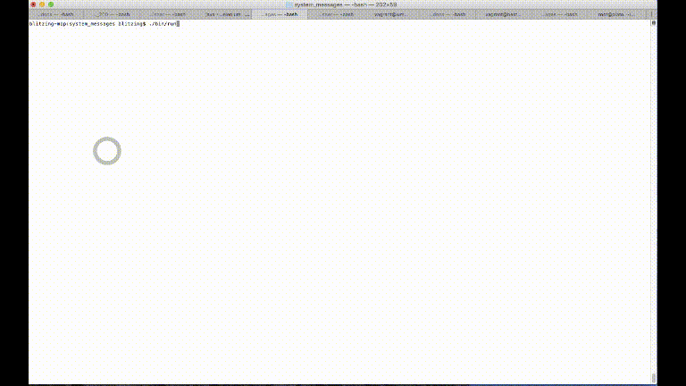

# ExpressionEngine Behat Example

### This repository is unsupported.

You will need to update some server paths and/or database connection info in the following files:

    - Test/ee.php
    - Test/Context/SuiteContext.php
    - system/user/config/config.php
    - bin/selenium
    - circle.yml
    - apache-ci.conf

This repository is meant to serve as an example of how to get started using Behat to test your
ExpressionEngine sites. It will not work out of the box... you will need to update or start from scratch with
the files in the Context and Features folders. It is advised to spend some time on behat.org to learn its intricacies.
It also assumes you are using Composer to install and manage your dependencies.

This repository contains an example setup of Behat for testing an ExpressionEngine site. It includes a pre-configured behat.yml
file with a non-default Behat directory structure, a SuiteContext file that will drop and import a pristine database before
executing your tests.

The field.feature and FieldContext files contain an example of how to add rows to your database tables
for testing.

The TestRequestService.php file is an example of how you may need to implement an interface and provide mock classes to your
test files.

# Selenium Testing

In order to run the Selenium browser tests you will need to have a Selenium server instance running.
You can download a standalone server .jar file, then use the bin/selenium command to start the server.
Update the path to the .jar file in bin/selenium first.

# Running Tests

Run the following commands in two different terminal windows. Selenium needs to remain running in the background while Behat is running.

`./bin/selenium`

`./bin/behat`

# CircleCI

Setting up CircleCI is surprisingly simple. Customize the circle.yml file as needed and read CircleCI's documentation https://circleci.com/docs/manually. Circle is magical, it installs PHP, MySQL, and nearly everything else you need to get a working VM to run your tests. It just works.

# Preview
This is what it looks like when tests are running locally and you're using using Selenium to control the browser. All interactions are scripted and repeatable. If configured properly, CircleCI will run the same tests in a headless browser and take screenshots if a test fails so you can see the browser state on a failed test.

